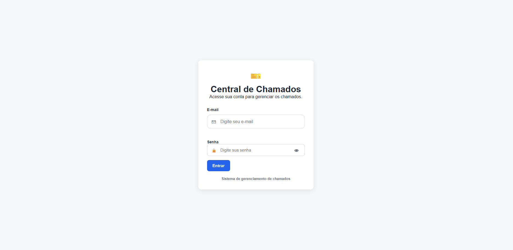
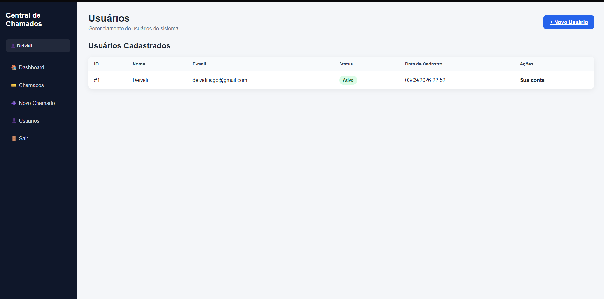

# 🎫 Central de Chamados - FastAPI

Sistema web para gerenciamento de chamados desenvolvido com **Python, FastAPI e PostgreSQL**.

O projeto foi criado com foco em desenvolvimento backend e construção de portfólio, aplicando autenticação, gerenciamento de usuários, filtros, pesquisa, controle de chamados, segurança, testes e containerização com Docker.

---

## 🌐 Sistema Online

[](https://central-chamados-fastapi.onrender.com/login-web)

---

## 🚀 Funcionalidades

- Login de usuários
- Controle de sessão
- Cadastro de usuários
- Ativação e inativação de usuários
- Proteção contra inativar a própria conta
- Cadastro de chamados
- Listagem de chamados
- Visualização de detalhes
- Alteração de status
- Filtro por status
- Filtro por prioridade
- Pesquisa por título
- Autocomplete na pesquisa
- Dashboard com indicadores
- Validação de senha
- API REST protegida com JWT

---

## 🛠️ Tecnologias utilizadas

### Backend
- Python
- FastAPI
- SQLAlchemy
- Pydantic
- JWT
- Argon2

### Banco de dados
- PostgreSQL
- Neon PostgreSQL

### Frontend
- Jinja2
- HTML5
- CSS3
- JavaScript

### DevOps e ferramentas
- Docker
- Render
- Pytest
- Git
- GitHub

---

## 📊 Dashboard

O sistema possui um dashboard com indicadores de:

- Total de chamados
- Chamados abertos
- Chamados em andamento
- Chamados resolvidos

Também apresenta os chamados mais recentes cadastrados no sistema.

---

## 👤 Gerenciamento de usuários

O módulo de usuários permite:

- Cadastrar novos usuários
- Ativar usuários
- Inativar usuários
- Visualizar o status da conta
- Impedir que o usuário logado inative a própria conta

As senhas são armazenadas utilizando **hash Argon2**.

---

## 🎫 Gerenciamento de chamados

Cada chamado possui:

- Título
- Descrição
- Prioridade
- Status
- Usuário responsável
- Data de criação

Os chamados podem ser pesquisados e filtrados por:

- Título
- Status
- Prioridade

A pesquisa possui **autocomplete**, exibindo sugestões conforme o usuário digita.

---

## 🔐 Segurança

O projeto possui:

- Hash de senhas com Argon2
- Autenticação JWT para a API
- Sessões para a interface web
- Rotas protegidas
- Validação de usuários ativos
- Validação de tamanho mínimo de senha
- Proteção contra inativação da própria conta
- Variáveis sensíveis armazenadas em `.env`
- `.env` protegido pelo `.gitignore`
- `.env` excluído também da imagem Docker

---

## 🖼️ Screenshots

### Interface do sistema






---

## 🐳 Docker

O projeto possui suporte a Docker.

Para criar a imagem:

```bash
docker build -t central-chamados-fastapi .
```

Para executar o container:

```bash
docker run -p 8000:8000 --env-file .env central-chamados-fastapi
```

---

## ⚙️ Como executar o projeto localmente

Clone o repositório:

```bash
git clone https://github.com/DeividiLuccasdev/central-chamados-fastapi.git
```

Entre na pasta:

```bash
cd central-chamados-fastapi
```

Crie um ambiente virtual:

```bash
python -m venv .venv
```

Ative o ambiente virtual no Windows:

```powershell
.\.venv\Scripts\Activate.ps1
```

Instale as dependências:

```bash
pip install -r requirements.txt
```

Crie um arquivo `.env` baseado no `.env.example` e configure as variáveis necessárias.

Inicie o servidor:

```bash
uvicorn main:app --reload
```

Acesse:

```text
http://127.0.0.1:8000/login-web
```

Documentação da API:

```text
http://127.0.0.1:8000/docs
```

---

## 🧪 Testes

O projeto possui testes automatizados utilizando **Pytest**.

Para executar:

```bash
pytest
```

---

## ☁️ Deploy

A aplicação está publicada utilizando:

- **Render** para hospedagem da aplicação
- **Neon PostgreSQL** para o banco de dados em produção
- **Docker** para containerização

🌐 [Acessar aplicação online](https://central-chamados-fastapi.onrender.com/login-web)

---

## 👨‍💻 Autor

**Deividi Luccas**

- GitHub: [DeividiLuccasdev](https://github.com/DeividiLuccasdev)

---

## 📚 Objetivo do projeto

Projeto desenvolvido para praticar e demonstrar conhecimentos em:

**Python, FastAPI, APIs REST, PostgreSQL, autenticação, segurança, SQLAlchemy, desenvolvimento web, testes, Git, Docker e deploy em nuvem.**