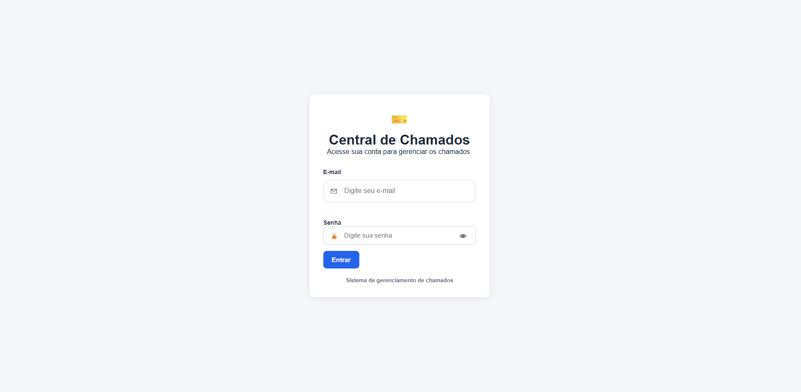
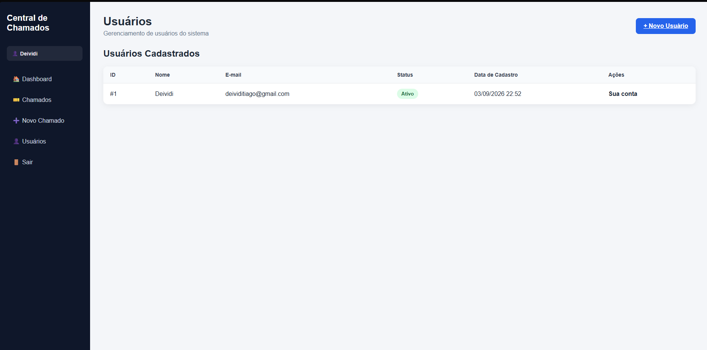

# 🎫 Central de Chamados - FastAPI

[](https://github.com/DeividiLuccasdev/central-chamados-fastapi/actions/workflows/ci.yml)


Sistema web para gerenciamento de chamados desenvolvido com **Python, FastAPI e PostgreSQL**.

O projeto foi criado com foco em desenvolvimento backend e construção de portfólio, aplicando autenticação, gerenciamento de usuários, filtros, pesquisa, controle de chamados, segurança, testes e containerização com Docker.

---

## 🌐 Sistema Online

[](https://central-chamados-fastapi.onrender.com/login-web)

> ⏳ **O primeiro acesso pode demorar de 30 a 60 segundos.** A aplicação usa o plano gratuito do Render, que "adormece" o servidor após 15 minutos sem uso. Depois que ele acorda, tudo responde normalmente.

---

## 🚀 Funcionalidades

- Login de usuários
- Controle de sessão
- Cadastro de usuários
- Ativação e inativação de usuários
- Proteção contra inativar a própria conta
- Cadastro de chamados
- Listagem de chamados
- Visualização de detalhes
- Alteração de status
- Filtro por status
- Filtro por prioridade
- Pesquisa por título
- Autocomplete na pesquisa
- Dashboard com indicadores
- Validação de senha
- Registro de data de atualização e de fechamento dos chamados
- API REST protegida com JWT e documentada com OpenAPI (Swagger)

---

## 🛠️ Tecnologias utilizadas

### Backend
- Python
- FastAPI
- SQLAlchemy
- Pydantic
- JWT
- Argon2

### Banco de dados
- PostgreSQL
- Neon PostgreSQL

### Frontend
- Jinja2
- HTML5
- CSS3
- JavaScript

### DevOps e ferramentas
- Docker
- Render
- Pytest
- Ruff
- GitHub Actions (CI)
- Git
- GitHub

---

## 🗂️ Estrutura do projeto

```text
app/
├── main.py            # Criação da aplicação, middlewares e rotas
├── core/
│   ├── config.py      # Configurações lidas do .env (pydantic-settings)
│   └── security.py    # Hash de senhas (Argon2) e tokens JWT
├── database.py        # Conexão com o banco e sessão do SQLAlchemy
├── models.py          # Modelos Usuario e Chamado
├── schemas.py         # Validação de entrada e saída da API (Pydantic)
├── dependencies.py    # Autenticação da API (JWT) e das páginas (sessão)
├── templating.py      # Configuração do Jinja2 e filtros
├── routers/
│   ├── api.py         # API REST
│   └── web.py         # Páginas web
├── templates/         # HTML (layout base + páginas)
└── static/            # CSS
scripts/               # Criação das tabelas, usuários e teste de conexão
testes/                # Testes automatizados (pytest)
```

---

## 📊 Dashboard

O sistema possui um dashboard com indicadores de:

- Total de chamados
- Chamados abertos
- Chamados em andamento
- Chamados resolvidos

Também apresenta os chamados mais recentes cadastrados no sistema.

---

## 👤 Gerenciamento de usuários

O módulo de usuários permite:

- Cadastrar novos usuários
- Ativar usuários
- Inativar usuários
- Visualizar o status da conta
- Impedir que o usuário logado inative a própria conta

As senhas são armazenadas utilizando **hash Argon2**.

---

## 🎫 Gerenciamento de chamados

Cada chamado possui:

- Título
- Descrição
- Prioridade
- Status
- Usuário responsável
- Data de criação
- Data da última atualização
- Data de fechamento

Os chamados podem ser pesquisados e filtrados por:

- Título
- Status
- Prioridade

A pesquisa possui **autocomplete**, exibindo sugestões conforme o usuário digita.

---

## 🔐 Segurança

O projeto possui:

- Hash de senhas com Argon2
- Autenticação JWT para a API
- Sessões para a interface web
- Rotas protegidas
- Validação de usuários ativos (usuários inativados perdem a sessão e o token)
- Validação de tamanho mínimo de senha
- Proteção contra inativação da própria conta
- Variáveis sensíveis armazenadas em `.env`
- `.env` protegido pelo `.gitignore`
- `.env` excluído também da imagem Docker
- Aplicação não sobe sem `JWT_SECRET_KEY` configurada
- Cookie de sessão com `SameSite=Lax` e `HTTPS only` ativado automaticamente no Render
- Container executado sem usuário root

---

## 🖼️ Screenshots

### Interface do sistema






---

## 🐳 Docker

O projeto possui suporte a Docker.

Para criar a imagem:

```bash
docker build -t central-chamados-fastapi .
```

Para executar o container:

```bash
docker run -p 8000:8000 --env-file .env central-chamados-fastapi
```

---

## ⚙️ Como executar o projeto localmente

Clone o repositório:

```bash
git clone https://github.com/DeividiLuccasdev/central-chamados-fastapi.git
```

Entre na pasta:

```bash
cd central-chamados-fastapi
```

Crie um ambiente virtual:

```bash
python -m venv .venv
```

Ative o ambiente virtual no Windows:

```powershell
.\.venv\Scripts\Activate.ps1
```

Instale as dependências (as de desenvolvimento incluem pytest e ruff):

```bash
pip install -r requirements-dev.txt
```

Crie um arquivo `.env` baseado no `.env.example` e configure as variáveis necessárias.

Crie as tabelas no banco:

```bash
python -m scripts.criar_tabelas
```

Crie o primeiro usuário (a senha é pedida no terminal):

```bash
python -m scripts.criar_usuario --email voce@exemplo.com --nome "Seu Nome"
```

> O mesmo comando redefine a senha de um usuário que já existe.

Inicie o servidor:

```bash
uvicorn app.main:app --reload
```

Acesse:

```text
http://127.0.0.1:8000/login-web
```

Documentação da API:

```text
http://127.0.0.1:8000/docs
```

---

## 🔧 Variáveis de ambiente

| Variável | Obrigatória | Descrição |
|---|---|---|
| `JWT_SECRET_KEY` | Sim | Chave usada para assinar os tokens JWT e o cookie de sessão |
| `DATABASE_URL` | Não | URL completa do banco (Neon / Render). Tem prioridade sobre as variáveis `DB_*` |
| `DB_HOST`, `DB_PORT`, `DB_NAME`, `DB_USER`, `DB_PASSWORD` | Não | Dados do banco local |
| `JWT_EXPIRACAO_MINUTOS` | Não | Validade do token (padrão: 60) |
| `SESSION_HTTPS_ONLY` | Não | Cookie de sessão só via HTTPS. Se não for informada, é ativada automaticamente no Render |

---

## 🔌 API REST

Faça login em `POST /login` e envie o token recebido no cabeçalho `Authorization: Bearer <token>`.

| Método | Rota | Descrição |
|---|---|---|
| `POST` | `/login` | Gera o token de acesso |
| `GET` | `/perfil` | Dados do usuário autenticado |
| `POST` | `/usuarios` | Cadastra um usuário |
| `GET` | `/chamados` | Lista chamados (filtros: `status`, `prioridade`; paginação: `limite`, `deslocamento`) |
| `POST` | `/chamados` | Abre um chamado |
| `GET` | `/chamados/{id}` | Detalhes de um chamado |
| `PATCH` | `/chamados/{id}/status` | Altera o status (`aberto`, `em andamento`, `resolvido`) |
| `GET` | `/health` | Verificação de saúde da aplicação |

---

## 🧪 Testes

O projeto possui testes automatizados utilizando **Pytest**, cobrindo a API e as páginas web. Os testes usam um banco SQLite em memória, então não precisam de PostgreSQL.

Para executar os testes e o lint:

```bash
pytest
ruff check .
```

A cada push e pull request, o **GitHub Actions** executa o lint, os testes e o build da imagem Docker.

---

## ☁️ Deploy

A aplicação está publicada utilizando:

- **Render** para hospedagem da aplicação
- **Neon PostgreSQL** para o banco de dados em produção
- **Docker** para containerização

🌐 [Acessar aplicação online](https://central-chamados-fastapi.onrender.com/login-web)

---

## 👨‍💻 Autor

**Deividi Luccas**

- GitHub: [DeividiLuccasdev](https://github.com/DeividiLuccasdev)

---

## 📚 Objetivo do projeto

Projeto desenvolvido para praticar e demonstrar conhecimentos em:

**Python, FastAPI, APIs REST, PostgreSQL, autenticação, segurança, SQLAlchemy, desenvolvimento web, testes, Git, Docker e deploy em nuvem.**